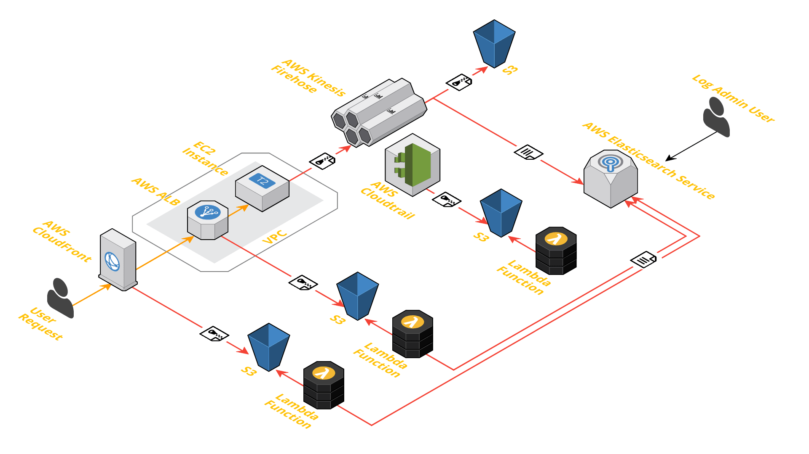

KELK: **K**inesis **E**lasticsearch **L**ambda **K**ibana
===================================================

An example of a low maintenance logging pattern using AWS services
------------------------------------------------------------------



#### Logs are ingested into Elasticsearch Service from 4 sources:

* Apache access logs on an EC2 instance
  * Apache writes logs to a file
  * [Kinesis Agent](http://docs.aws.amazon.com/firehose/latest/dev/writing-with-agents.html) tails the log and adds new lines to a Kinesis Firehose Delivery Stream
  * Kinesis Firehose has two destinations:
    * S3 for long term storage
    * Elasticsearch Service for short term analytics
* ALB access logs
  * ALB writes the access logs to an S3 bucket
  * A Lambda is triggered from the PutObject event on the S3 bucket and writes the record to Elasticsearch Service
* Cloudfront access logs
  * Cloudfront writes the access logs to an S3 bucket
  * A Lambda is triggered from the PutObject event on the S3 bucket and writes the record to Elasticsearch Service
* Cloudtrail logs
  * Cloudtrail writes the logs to an S3 bucket
  * A Lambda is triggered from the PutObject event on the S3 bucket and writes the record to Elasticsearch Service

#### Prerequisites

* Terraform (tested with 0.10.7)
* A unix-like environment (tested with MacOS 10.12.6)
* Python `pip` in your `PATH`
* `curl` in your `PATH`
* [aws-es-proxy](https://github.com/abutaha/aws-es-proxy) in your `PATH`
* An AWS account

#### Running

* Export AWS access key and secret key via environmental variables or an awscli credentials file http://docs.aws.amazon.com/cli/latest/userguide/cli-chap-getting-started.html
* Run Terraform to spin up the infrastructure (this will take ~20mins)
```shell
$ terraform init
$ terraform plan
$ terraform apply
```
* Run aws-es-proxy using the `elasticsearch_endpoint` Terraform output
```shell
$ aws-es-proxy --endpoint $(terraform output elasticsearch_endpoint) &
```
* Run `setup_indices.sh` to configure the required index patterns in Kibana
```shell
$ ./setup_indices.sh
```
* Wait ~20 mins for the Cloudfront distribution creation to propogate and then send some requests to Cloudfront to generate some logs from the 4 log sources
```shell
$ for ((n=0;n<50;n++)); do curl $(terraform output cloudfront_domain_name); done
```
* View Kibana by visiting http://localhost:9200/_plugin/kibana/

#### Notes

New ALBs and Cloudfront distributions can take several minutes to generate a log object in S3 after the first request
